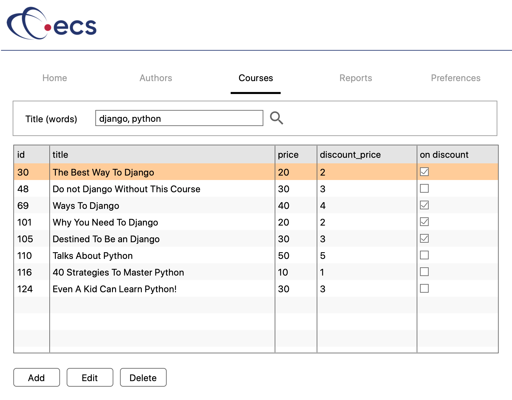

# Challenge Description
In this challenge, your are asked to complete a [Flask](https://flask.palletsprojects.com)-based **API**, for a number of e-learning courses.

To illustrate the API, here is a mockup of a GUI, which uses it:



As shown, it's like a simple [Udemy](https://www.udemy.com).

## System Architecture
The API has a very simple architecture, as shown below:


In this, a JSON file of courses is loaded into one or more data structures, when the Flask application starts. This data is used by the API to service the API requests (basic [CRUD](https://en.wikipedia.org/wiki/Create,_read,_update_and_delete) operations). However, please note that, in this challenge, there is no need to persist the data back to the JSON file.

## Resources
You are given:

- A JSON data file containing 200 courses (see **course.json**)
- A Flask application (see **run.py**)
- The empty API routes (see **routes/course.py**)
- Some example test files (see folder **tests**), in Postman and cURL formats

## Goals
The goals are to:

- Devise a way to load the data into into one or more in-memory structures
- Complete the API routes, ensuring efficient access to the data
- Write basic unit tests

## Desired Technology Stack
- Python 3.6+
- Flask
- A Python unit testing framework (nosetests, pytest, unittest, etc.)
- Any other libraries you need

## Unit Test Requirements
- Unit tests implemented using any Python framework
- Include tests for data validation
- Include tests for error handling
- Test coverage of 80% on the implemented code
- Screenshot of test output

## Installation
You should have a working Python 3.6+ environment (or virtual environment). Install the requirements (see **requirements.txt**) into this environment. Install other libraries as required (e.g. a Python testing library).

## Running the Application
To run the Flask application, do:

```bash
python run.py
```
The API will be available on port 5000.

# The Data Model
The data model has a single entity: **course**. The columns are shown below:

| name | type | min length| max length | required | primary key | unique | system |
|---|---|---|---|---|---|---|---|
| id | integer |  |  | yes | yes | yes | yes |
| date_created | datetime |  |   | yes |   |   | yes |
| date_updated | datetime |  |  |  yes |   |   | yes |
| description | string |  | 255 |    |   |   |  |
| image_path | string |  | 100 |  |   |   |  |
| on_discount | boolean |  |  |  yes |   |   |  |
| price | decimal |  |  |  yes |   |   |  |
| title | string) | 5 | 100 |  yes  |   |   |  |

Notes:
- The **system** setting means that your API should maintain the values, not the caller of the API. For example, when inserting a new record, your API provides the **id**.
- Datetimes may be stored as strings.

Here is an example record, corresponding to the above schema:

```json
{
    "date_created": "2019-08-19 11:26:44", 
    "date_updated": "2020-02-04 06:34:09", 
    "description": "Django, named after Belgian guitarist Jean Reinhardt, is a Python-based, free and open-source web framework.", 
    "discount_price": 2, 
    "id": 101, 
    "image_path": "", 
    "on_discount": true, 
    "price": 20, 
    "title": "Why You Need To Django"
}
```

# The API

The API routes are as follows:

|Verb|Endpoint|Parameters/Post Data|Description|
|----|----|----|----|
|GET | /course/{id} |id| Get a single course, identified by id|
|GET | /course |title-words, page-number, page-size| Get a page of courses, optionally filtered by title words|
|POST | /course |[title, image_path, price, on_discount, discount_price, description]| Create a course|
|PUT | /course/{id} |id, [id, title, image_path, price, on_discount, discount_price, description]| Update a course, identified by id|
|DELETE | /course/{id} |id| Delete a course, identified by id|

## Get a Single Course Identified by id
In this task, you wish to return a record based on the specified id.

### Example Call
```bash
## Get course by id
curl "http://localhost:5000/course/101"
```

|Verb|Endpoint|Parameters/Post Data|Description|
|----|----|----|----|
|GET | /course/{id} |id| Get a single course, identified by id|


### Example Response
```text
HTTP/1.0 200 OK
Content-Type: application/json
Content-Length: 387
Server: Werkzeug/1.0.1 Python/3.9.0
Date: Mon, 01 Mar 2021 16:56:46 GMT
```
```json
{
  "data": {
    "date_created": "2019-08-19 11:26:44", 
    "date_updated": "2020-02-04 06:34:09", 
    "description": "Django, named after Belgian guitarist Jean Reinhardt, is a Python-based, free and open-source web framework.", 
    "discount_price": 2, 
    "id": 101, 
    "image_path": "", 
    "on_discount": true, 
    "price": 20, 
    "title": "Why You Need To Django"
  }
}
```

### Example Error Response
```text
HTTP/1.0 404 NOT FOUND
Content-Type: application/json
Content-Length: 42
Server: Werkzeug/1.0.1 Python/3.9.0
Date: Mon, 01 Mar 2021 17:25:12 GMT
```
```json
{
  "messge": "Course 0 does not exist"
}
```

### Challenge Notes
- Bonus points for not using a linear scan on your data structure. That is, accessing the first item should be as fast as accessing the last.

## Get a Page of Courses Optionally Filtered by Title Words
This route returns a single page of data. 

|Verb|Endpoint|Parameters/Post Data|Description|
|----|----|----|----|
|GET | /course |title-words, page-number, page-size| Get a page of courses, optionally filtered by title words|

Please note that the title can contain multiple words separated by commas.

### Example Call
In this example, we specify a page size of 5, to limit the example results.
```bash
## Get default page of courses
curl "http://localhost:5000/course?page-size=5"
```

### Example Response
Note at the end, the **metadata** field defines the number of pages, current page, page size and the overall number of records which matched.
```text
HTTP/1.0 200 OK
Content-Type: application/json
Content-Length: 2672
Server: Werkzeug/1.0.1 Python/3.9.0
Date: Mon, 01 Mar 2021 16:59:07 GMT
```
```json
{
  "data": [
    {
      "date_created": "2019-12-25 12:57:58", 
      "date_updated": "2020-12-18 16:18:29", 
      "description": "Scala is a multi-paradigm, general-purpose programming language.", 
      "discount_price": 2, 
      "id": 1, 
      "image_path": "", 
      "on_discount": false, 
      "price": 20, 
      "title": "The Art of Scala"
    }, 
    {
      "date_created": "2019-03-16 05:15:39", 
      "date_updated": "2020-12-29 08:40:44", 
      "description": "Agile practices discover requirements and develop solutions through collaborative effort.", 
      "discount_price": 3, 
      "id": 2, 
      "image_path": "", 
      "on_discount": true, 
      "price": 30, 
      "title": "The Joy of Agile"
    }, 
    {
      "date_created": "2020-09-13 14:40:39", 
      "date_updated": "2020-09-23 10:52:39", 
      "description": "Pages is a word processor developed by Apple Inc.", 
      "discount_price": 5, 
      "id": 3, 
      "image_path": "", 
      "on_discount": false, 
      "price": 50, 
      "title": "Talks About Pages"
    }, 
    {
      "date_created": "2020-07-20 17:51:23", 
      "date_updated": "2020-08-04 12:06:58", 
      "description": "Microsoft Visual Studio is an integrated development environment (IDE) from Microsoft.", 
      "discount_price": 2, 
      "id": 4, 
      "image_path": "", 
      "on_discount": false, 
      "price": 20, 
      "title": "This Is A Course About Visual Studio"
    }, 
    {
      "date_created": "2020-07-04 01:02:49", 
      "date_updated": "2021-01-31 15:07:20", 
      "description": "Scala is a multi-paradigm, general-purpose programming language.", 
      "discount_price": 3, 
      "id": 5, 
      "image_path": "", 
      "on_discount": true, 
      "price": 30, 
      "title": "Even A Kid Can Learn Scala!"
    }
  ], 
  "metadata": {
    "page_count": 40, 
    "page_number": 1, 
    "page_size": 5, 
    "record_count": 200
  }
}
```

### Example Call with Title Words
In this example, one or more word search words, separated by commas, are provided.
```bash
## Get page of courses by title words
curl "http://localhost:5000/course?title-words=enterprise,quick"
```

### Challenge Notes
- Bonus points for not using a linear scan, on your data structure, if
title-words is supplied
- Bonus points for returning resulted sorted by the number of words which
matched, if title-words is supplied.
- Bonus points for including performance data on the API, in terms of
requests/second.

## Create a Course
This route is used to insert a new course. As discussed previously, the (unique) record id should be calculated by the system.

|Verb|Endpoint|Parameters/Post Data|Description|
|----|----|----|----|
|POST | /course |[title, image_path, price, on_discount, discount_price, description]| Create a course|

### Example Call
```bash
## Add course
curl -X "POST" "http://localhost:5000/course" \
     -H 'Content-Type: application/json' \
     -d $'{
  "description": "This is a brand new course",
  "discount_price": 5,
  "title": "Brand new course",
  "price": 25,
  "image_path": "images/some/path/foo.jpg",
  "on_discount": false
}
```

### Example Response
```text
HTTP/1.0 201 CREATED
Content-Type: application/json
Content-Length: 342
Server: Werkzeug/1.0.1 Python/3.9.0
Date: Mon, 01 Mar 2021 17:00:04 GMT
```
```json
{
  "data": {
    "date_created": "2021-03-01 17:00:04.252143", 
    "date_updated": "2021-03-01 17:00:04.252143", 
    "description": "This is a brand new course", 
    "discount_price": 5.0, 
    "id": 201, 
    "image_path": "images/some/path/foo.jpg", 
    "on_discount": false, 
    "price": 25.0, 
    "title": "Brand new course"
  }
}
```

### Challenge Notes
- Bonus points for validating the POST body fields

## Update a Course, Identified by id

|Verb|Endpoint|Parameters/Post Data|Description|
|----|----|----|----|
|PUT | /course/{id} |id, [id, title, image_path, price, on_discount, discount_price, description]| Update a course, identified by id|

### Example Call
```bash
## Update course
curl -X "PUT" "http://localhost:5000/course/201" \
     -H 'Content-Type: application/json' \
     -d $'{
  "image_path": "images/some/path/foo.jpg",
  "discount_price": 5,
  "id": 201,
  "price": 25,
  "title": "Blah blah blah",
  "on_discount": false,
  "description": "New description"
}
```

### Example Response
```text
HTTP/1.0 200 OK
Content-Type: application/json
Content-Length: 278
Server: Werkzeug/1.0.1 Python/3.9.0
Date: Mon, 01 Mar 2021 17:11:20 GMT
```
```json
{
  "data": {
    "date_updated": "2021-03-01 17:11:20.005061", 
    "description": "New description", 
    "discount_price": 5.0, 
    "id": 201, 
    "image_path": "images/some/path/foo.jpg", 
    "on_discount": false, 
    "price": 25.0, 
    "title": "Blah blah blah"
  }
}
```

### Example Error Response
```text
HTTP/1.0 400 BAD REQUEST
Content-Type: application/json
Content-Length: 49
Server: Werkzeug/1.0.1 Python/3.9.0
Date: Mon, 01 Mar 2021 17:27:33 GMT
```
```json
{
  "message": "The id does match the payload"
}
```

### Challenge Notes
- Bonus points for validating the PUT body fields, including against the id in the url

## Delete a Course, Identified by id

|Verb|Endpoint|Parameters/Post Data|Description|
|----|----|----|----|
|DELETE | /course/{id} |id| Delete a course, identified by id|

### Example Call
```bash
## Delete course by id
curl -X "DELETE" "http://localhost:5000/course/201"
```

### Example Response
```text
HTTP/1.0 200 OK
Content-Type: application/json
Content-Length: 52
Server: Werkzeug/1.0.1 Python/3.9.0
Date: Mon, 01 Mar 2021 17:19:33 GMT
```
```json
{
  "message": "The specified course was deleted"
}
```

### Example Error Response
```text
HTTP/1.0 404 NOT FOUND
Content-Type: application/json
Content-Length: 44
Server: Werkzeug/1.0.1 Python/3.9.0
Date: Mon, 01 Mar 2021 17:23:29 GMT
```
```json

{
  "messge": "Course 201 does not exist"
}
```


### Challenge Notes
None
